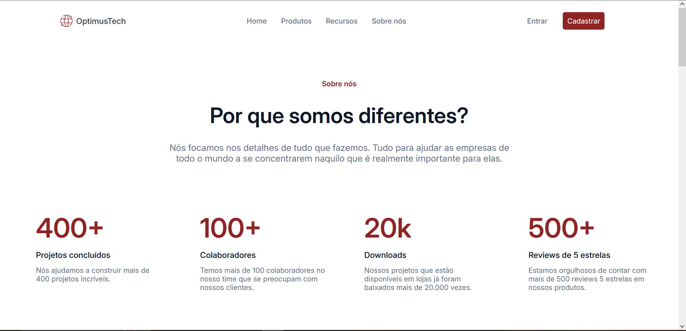

# Projeto: 7 Days in Code
Esse projeto tem como objetivo criar uma landing page para a empresa fictícia "Optimus Tech".
# Imagens do projeto:

## Sobre o projeto
 O desafio "7 Days in Code" da Alura é fazer uma parte por dia, por exemplo, no último dia realizei o rodapé e nos primeiros dias realizei o cabeçalho. Eu gostei de ter realizado, pois pude colocar em prática o que eu aprendi com o curso, além do que aprendo em meus projetos pessoais. Tomei cuidado quanto a semântica das tags HTML e quanto a estilização foi bem tranquilo.
 Está disponível no Vercel: https://desafio-7-days-in-code.vercel.app/
### Tecnologias utilizadas:
* HTML
* CSS

### Feito por:
Gustavo Baister.
